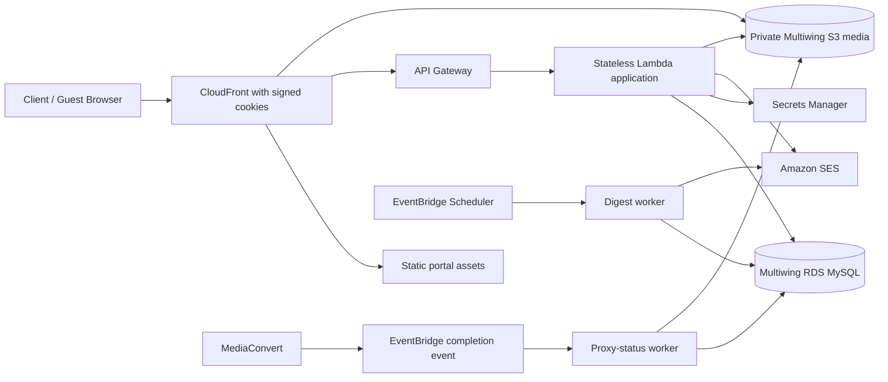

# Multiwing AWS Migration: Independent Architecture Review and Recommendation

**Prepared for:** Faderlabs

**Prepared by:** Manus AI

**Decision status:** Planning only. No Multiwing production data, media, credentials, DNS, or client access has been changed.

## Executive Recommendation

The three independent reviews support the same core conclusion: Multiwing should move to an **isolated AWS environment in stages**, while the current portal remains the authoritative, live system until a tested cutover window. The migration should not be treated as a copy of the Faderlabs landing-page move. Multiwing contains private client media, interactive approval records, comments, guest-share/OTP access, scheduled activity email, analytics, and asynchronous media processing. Its migration therefore needs a formal data-reconciliation and rollback process.

> **Recommended decision:** build a parallel, private AWS staging environment first; migrate and reconcile copies of data and media; rehearse a final delta synchronization; then move `multiwing.faderlabs.ai` only after explicit approval and a planned maintenance window. Do not make a DNS change or begin an irreversible media migration during the architecture phase.

| Decision area | Final recommendation | Reason |
|---|---|---|
| AWS isolation | Dedicated Multiwing stack, database, media bucket, CloudFront distribution, secrets, and deployment role | Separates client data and operational risk from Faderlabs marketing infrastructure. |
| Database transfer | Full snapshot followed by rehearsed, one-way delta synchronization and a brief write freeze | Prevents lost comments, approvals, shares, OTPs, and project requests between first import and cutover. |
| Media delivery | Private S3, CloudFront Origin Access Control, and signed cookies for portal browsing; short-lived presigned URLs only for explicit download/upload actions | Eliminates the current direct public-object pattern while keeping large media usable. |
| Authentication | Preserve the current client login experience at cutover; introduce individual client identities in a post-cutover hardening release | Minimizes client disruption during migration while establishing a clear retirement plan for shared access. |
| Scheduling | EventBridge Scheduler invokes an idempotent digest worker | Replaces the in-process cron job and avoids missed or duplicated digests during parallel operation. |
| Media conversion | Environment-scoped MediaConvert jobs with EventBridge completion routed to a private worker that updates RDS | Avoids a public callback dependency and prevents staging/completion events from updating the wrong environment. |

## Independent Review Results

OpenAI, Grok, and Anthropic all endorsed a parallel, reversible migration and identified **data drift, media exposure, authentication continuity, and rollback discipline** as the decisive risks. OpenAI recommended individual Cognito identities before cutover; Grok recommended retaining the existing shared-password experience for the cutover and replacing it shortly after; Anthropic recommended a lightweight JWT/OTP design instead of Cognito at first. [1] [2] [3]

The implementation recommendation is therefore a deliberate compromise. The first AWS release should retain the existing client password flow only as a **temporary compatibility layer**, but move all session creation, secrets, rate limits, OTP handling, audit logging, and guest sharing into the new AWS environment. Individual client identities should be designed during the migration but released after cutover, once client access can be migrated in a controlled way. This reduces immediate cutover risk without allowing the shared password to become permanent.

| Topic | OpenAI | Grok | Anthropic | Reconciled decision |
|---|---|---|---|---|
| Cutover posture | Staged and reversible | Parallel staging, final freeze, 48-hour hyper-care | Never change DNS before a rehearsed delta sync | Adopt the common staged, reversible approach. |
| Client identities | Move to individual Cognito identities before cutover | Retain shared password briefly, migrate within 14 days | Defer Cognito; use JWT/OTP-first identity | Preserve current client sign-in at cutover, but implement post-cutover individual identity migration as a dated hardening release. |
| Guest shares | OTP-based access | Preserve session/OTP continuity during delta | Explicitly migrate or invalidate OTP/session states safely | Reissue or deliberately expire guest OTPs and sessions during the maintenance window; never leave ambiguous states. |
| Media security | Private S3 with CloudFront signed delivery plus presigned actions | Signed cookies for browsing; short URLs for downloads | Signed cookies as the sole browsing path, OAC enforced | Private S3 plus CloudFront OAC and signed cookies; use presigned URLs only for narrowly scoped uploads/downloads. |
| Data synchronization | DMS full load plus CDC | Snapshot, checksums, delta sync, write freeze | Export/import plus two delta rehearsals | Assess DMS feasibility against the current source; otherwise use a tested application-level export and one-way delta process. |
| Background work | SES and EventBridge | EventBridge before cutover | EventBridge with idempotency controls | Replace in-process cron before cutover and use a digest watermark to prevent duplicates. |

## Target AWS Architecture

The recommended architecture uses a dedicated Multiwing network and data boundary within the existing AWS account. The application should run as a stateless API service behind API Gateway, with its runtime secrets loaded from Secrets Manager and access provided through narrowly scoped IAM roles. GitHub Actions should deploy through a separate GitHub OIDC role, not through long-lived AWS credentials in the application or repository.

Private media should be stored in a dedicated S3 bucket with public access blocked. CloudFront should be the only permitted S3 reader through an Origin Access Control; AWS recommends OAC over the legacy OAI model and documents restricting the bucket policy to the exact distribution. [4] Client portal browsing can then use signed cookies, while explicit download and upload actions use short-lived, scope-limited signed URLs.

The scheduled digest must be idempotent because EventBridge Scheduler provides at-least-once delivery and supports retry handling. The digest worker should record the completed time window in RDS before sending mail or use a transactionally stored idempotency key, so one window cannot be delivered twice. [5]

MediaConvert should remain part of the target design because it is appropriate for file-based, large-media conversion and can produce browser-playable output from professional source formats. [6] The completion path should be event-driven and environment-tagged. A staging MediaConvert job must never be able to update a production deliverable record.

## Migration Sequence and Data-Preservation Controls

The migration should proceed in phases. Each phase has a clear exit gate and no production DNS action occurs before the final phase.

| Phase | Objective | Required evidence before proceeding |
|---|---|---|
| 0. Source baseline | Inventory schema, migrations, media keys/URLs, direct public links, scheduled jobs, and live user flows | Read-only database and media manifest; source-schema drift resolved; written rollback runbook. |
| 1. Empty AWS foundation | Provision isolated networking, RDS, private S3, CloudFront/OAC, API, secrets, SES, event scheduling, MediaConvert roles, and OIDC deployment access | No public S3 access; cold-start runtime tests; least-privilege review. |
| 2. Synthetic staging | Deploy application code with Manus dependencies replaced; create synthetic projects, media, comments, shares, OTPs, and digest data | End-to-end test results for every key workflow, including one MediaConvert job. |
| 3. Initial copy | Copy database snapshot and all media without deleting the source | Table row counts, stable record identifiers, file-count/size/checksum manifest, and zero missing-media exceptions. |
| 4. Delta rehearsal | Repeat a one-way delta import while the legacy portal remains authoritative | At least two successful rehearsals, measured duration, and explicit treatment for OTPs, guest sessions, comments, approvals, and requests created during the delta window. |
| 5. Cutover window | Pause writes briefly, apply final delta, validate, then manually change DNS | Approved change window, final reconciliation report, client access test, share/OTP test, email test, media playback test, and owner approval. |
| 6. Hyper-care | Monitor new AWS portal while retaining the legacy source as read-only evidence | Defined monitoring period, event/error review, backup validation, and a documented decision to retire the old environment. |

AWS DMS can support full-load plus change-data-capture workflows when the source supports the necessary change logs; for MySQL, this requires row-based binary logs. [7] We will first determine whether the current managed database exposes a compatible source and whether DMS is practical. If it is not, the fallback is a tested application-level export/import with a short, clearly communicated write freeze. The fallback must not be improvised on cutover day.

## Non-Negotiable Cutover Gates

The following controls are required before any change to `multiwing.faderlabs.ai`:

| Gate | Required outcome |
|---|---|
| Database reconciliation | All table counts match; foreign-reference and key checks pass; comments, approvals, projects, contacts, shares, OTPs, session records, and activity logs are accounted for. |
| Media reconciliation | Every expected audio, video, document, thumbnail, and proxy object is present; samples play or download through the new private delivery path. |
| Security validation | No public S3 objects; no application-held long-lived AWS credentials; least-privilege roles and secret access verified. |
| Authentication and sharing | Client sign-in, admin sign-in, new guest invitation, OTP verification, existing-share handling, revocation, and download access all pass. |
| Messaging | SES templates, event/open tracking, admin alerts, guest invites, OTP mail, and the scheduled digest all pass in the staging environment. |
| Media processing | A MediaConvert input creates a proxy, emits an event, updates only the intended environment’s database record, and delivers a browser-playable result. |
| Rollback rehearsal | DNS reversal, application rollback, database source-of-truth decision, and owner communications are written and rehearsed. |

## Rollback Rule

The phrase “rollback” needs a strict boundary. Before accepting any new write on AWS after the DNS change, it is safe to reverse DNS if the health checks fail. After AWS accepts authoritative new comments, approvals, or uploads, reversing DNS without copying those writes back would create split-brain data loss. At that point, the response should be a forward repair, not an automatic rollback.

This is why the cutover window should keep writes paused until the final health checks pass. It is safer than an automatic timer-based rollback that could discard a client’s newly submitted work.

## Recommended Scope Split

The first migration release should move the portal fully off Manus while retaining the existing user experience. The second, post-cutover hardening release should move client access from the shared password to individual identities, rotate all legacy credentials, retire old direct URLs, and improve audit capabilities. This split minimizes client disruption and avoids bundling a major identity redesign with the highest-risk data and media transfer.

| Release | Included work | Deferred work |
|---|---|---|
| Migration release | AWS environment, private media delivery, database/media copy, client/admin/guest compatibility, SES, EventBridge scheduling, MediaConvert events, reconciliation and cutover controls | No client-facing login redesign at cutover. |
| Hardening release | Individual client identities, guest-share policy refinement, password retirement, expanded audit controls, broader observability | Scheduled only after portal stability is confirmed. |

## Implementation Approval Request

The next safe action is to create a **read-only migration inventory and rollback runbook**, followed by an empty Multiwing AWS staging stack. This will not copy production data, alter the live portal, change the DNS record, or send client communication.

Implementation should begin only after the owner explicitly approves that staging-foundation work and confirms whether the current shared client password should remain temporarily at cutover, as recommended above.

## References

[1] [OpenAI independent review](./model-review-responses.md#openai-review)

[2] [Grok independent review](./model-review-responses.md#grok-review)

[3] [Anthropic independent review](./anthropic-model-review.md)

[4] [AWS: Restrict access to an Amazon S3 origin](https://docs.aws.amazon.com/AmazonCloudFront/latest/DeveloperGuide/private-content-restricting-access-to-s3.html)

[5] [AWS: What is Amazon EventBridge Scheduler?](https://docs.aws.amazon.com/scheduler/latest/UserGuide/what-is-scheduler.html)

[6] [AWS: What is AWS Elemental MediaConvert?](https://docs.aws.amazon.com/mediaconvert/latest/ug/what-is.html)

[7] [AWS: Creating tasks for ongoing replication using AWS DMS](https://docs.aws.amazon.com/dms/latest/userguide/CHAP_Task.CDC.html)
